Boozang Functional Overview
============

In this functional overview document we will explain the different functions of the Boozang test tool.
This document will be updated as the Boozang test service evolves and an updated copy can always be found on GitHub: 
https://ljunggren.github.io/boozang-fo/

This document is divided into the following sections:

  * [The Navigation](#the-navigation)
  * [The Function Bar](#the-function-bar)
  * [Settings](#settings)
      * [General](#general)
      * [Recording Events](#recording-events)
      * [DOM Strategy](#dom-strategy) 
      * [Validation Ignore](#validation-ignore)
      * [Subscription](#subscription)
      * [Service](#service)
  * [Test View](#test-view)
  * [Actions](#actions)
      * [Validate](#validate)
      * [Trigger Event](#trigger-event)
      * [Extract Data](#extract-data) 
      * [JS Code](#js-code)
      * [Plug Test-case](#plug-test-case)
      * [Comment](#comment)
      * [Refesh](#refresh)

The Navigation
------------
The Boozang test tools allows you to organize your project into modules and test cases. The project can contain one or many modules, which in turn contain one or many test cases. A typical example could be: an E-Commerce project such as the Angular Store, would contain modules such as Navigation, Store and
Landing Pages. In Navigation you would find test cases such as Header Navigation, Sidebar Navigation, Main Search, where functionality related to navigation would be found. In Store, you would find test cases for Add Item To Cart, Checkout Items, Clear Cart, etc. Below is a picture of the Boozang navigation bar for the Interactive Tutorial "Angular Store", where you can see the modules Fruit Interactive Tutorial and Your Space. As the Fruit Interactive Tutorial module has been expanded, we can see the test cases 'Add Random Fruits" and "Fruit Test" inside.

On the top you can see the operations (from left to right): Create New Module, Create New Test, Paste, Cut, and Copy. In the tree structure, the folder
 icons to the left of the module name shows if the module is expanded or not. To the left of the test name the icon shown denotes the test type. The test type can be either cell test, unit test, integration test or bug.

Here is an explanation of the functions:

Create Folder
 : Creates a folder in the test tree to keep your tests sorted

Create Test
 : Creates a new test. This creates an empty test which unlocks all test actions

Paste
 : Pastes an object that has been previously cut/copied

Cut
 : Cuts an object from the project tree

Copy
 : Copies an object from the project tree

Delete
 : Delete an object from the project tree. The object needs to be unlocked in order to be deleted. 

Lock
 : In order to be able to edit a test case or module, it needs to be unlocked in the project tree. This is done with the Edit-operation in 
 the Test case view. This is used to prevent multiple users editing the same test case. When other team members are working on something in
 the test tree, it will be shown as a closed lock. 

Module Name
 : The Module name should capture the test functionality, such as Navigation, or match project documentation, such as parts in the requirements specification. 

Test name
 : The Test names should explain what is being tested, or map to another document that does, such as a detailed test case document or requirement specification.

Project Title
 : The title of the project. This is decided by the project administrator and specified when setting up the project on https://api.boozang.com

Opened/Closed Module
  : The folder icon indicates if the module is expanded or not.

Test Type Icon
 : There are four different types of tests: Bug, Cell test, Unit Test and Integration Test. The icon indicates which.    

The Function Bar
------------
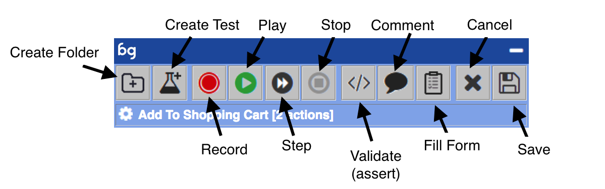

Here is an explanation of the functions:

Create Folder
 : Creates a folder in the test tree to keep your tests sorted

Create Test
 : Creates a new test. This creates an empty test which unlocks all test actions

Record
 : Records actions into the tests by registering events in the browser. The events being registered can be set in Settings (in hamburger menu)

Play
 : Runs the test

Step
 : Runs the test one step at a time

Stop
 : Stops current test run

Validate
 : Creates a validation, or in test language, assertion in the page

Comment
 : Creates a comment text box in the page. Useful to point out bugs and discrepancies
9. Fill Form: Fills out form and enables binding into JSON data structures
10. Cancel/Unlock: Reloads test from server. Local changes will be lost and lock removed
11. Save: Saves to server database. In order to release lock follow with cancel

Settings
------------
The Settings panel can be found in the Hamburger menu in the top right corner. The Settings are divided into tabs: General, Recording Events, Dom Strategy,
Validation Ignore, Subscription, Service. As soon as you update any settings in needs to be Saved to take effect. This will affect your user only,
and will persist between sessions for your user. If it's desired to change a setting for the whole project, use Save As Default. This change will be set 
on the project level and will affect all new sessions for other users. Note: Save As Default require Modify-privileges on the Project-level.

### General ###

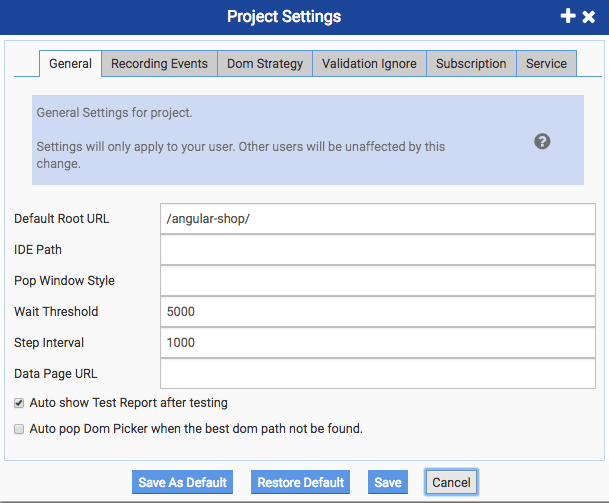

The General Settings tab allows the user to control basic test functionality and look & feel. Explanation of functions from top to bottom

Default Root URL
 : This is defines the starting point of your application relative to the bz.html-fragment. This means: the normal case when the bz.html is located in 
the same directory as index.html, this should be "/" or blank. Another common configuraion is when the bz.html is located in the root, and my index.httml is located one directory down, as the example "angular-shop". This will allow the "angular-shop" to be the default entry point. 

IDE Path
 : This is the exact path to the bz.html. This will help you finding the local test URL when inviting new users to the team. 

Pop Window Style
 : This allows you to put custom CSS for the tool-set window. By doing this the tool can be sized and positioned the same way every time it is launched.

Wait Threshold
 : Default value for maximum wait for validation. Can be overridden on a per action basis. 

Step Interval
 : This is the step delay when re-playing a test in slow mode.

Data Page URL
 : Entry URL for an API end-point. 

##### Check-boxes #####

Auto Show Test Report after testing
 : This means test report will be shown after each test run.

Auto Pop Dom Picker when the best DOM path can not be found
 : When there isn't a unique DOM path found, this will pop the DOM picker to allow you to further specify the exact DOM path desired.

### Recording Events ###
This settings tab allows the user to control which events should be captured when recording. 

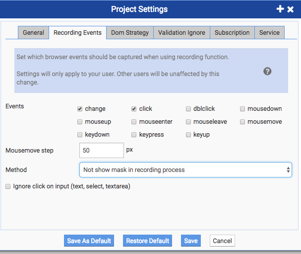

Explanation of functions from top to bottom

Events
 : Specifies which events should be captured in the recording process. 

Mousemove step
 : This specifies how often a new event should be captured when doing drag-and-drop. 50 px means that in order to test drag and drop, it will generate 
a new event every 50 px. 

Method
 : It's here possible to allow the user to show the DOM tree mask when recording. This will highlight the exact element in the DOM tree where the 
trigger event is generated.

##### Check-boxes #####

Ignore Click on Input
 : If checked clicking on input doesn't generate a separate event. If un-checked, every time an input is clicked it generates an event. This is normally not needed.

### DOM Strategy###

This is arguably the most important setting of the Boozang tool. The DOM Strategy allows you to configure how the tool uniquely identifies an
element in the DOM tree. As DOM tree conventions vary between different sites, this is something that is typically done once per project and left untouched.
Having a correct DOM tree strategy will determine how well the tool will work.

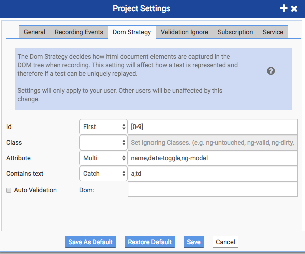

Explanation of functions from top to bottom

Id
 : Determine if you want to catch the Id attribute in the DOM tree. If you have unique ids that are non-dynamic, use First and leave the second field
blank. To support dynamic Ids, you can use Regexp ignore. As can be seen in the example, the Regexp ignore [0-9] matches on the characters in the ids and ignores numbers.

Class
 : Determines if you want to include the class when navigating the DOM tree. In the second field you can specify which classes to ignore. 

Attribute
 : Sets one or many special attributes to include when matching.

Contains text
 : In some cases, when ids cannot be enforced on all items, it's sometimes useful to match on the contents of an element. 

DOM
 : When clicked an auto-validation is added on each an every record step.  

### Validation Ignore###

Sets the default attributes that are ignored when creating a validation. The attributes not ignored will be included in the asserts-equals condition 
being build when doing a validation. This can also be set on each validation action, but the setting here should will allow the user to do one-click validations without doing further changes.

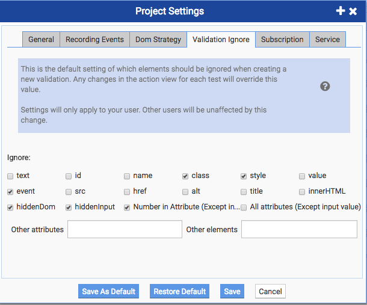

Ignore
 : The default attributes that should be ignored when doing validations. 

Other Attributes
 : Any other (custom) attributes that should be ignored 

Other Elements
 : Any other elements that should be ignored

### Subscriptions ###

This allows you to setup email notification for test runs. 

Server Host
 : Which server you want to send test reports to.

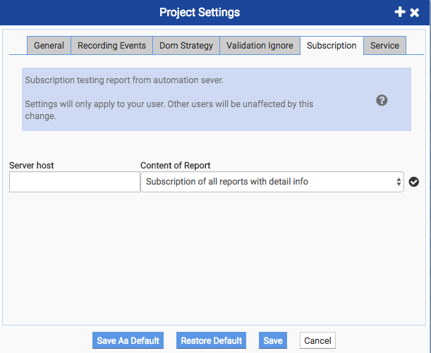

### Service ###

This is a experimental screen for posting TR reports and screen-shots to an external API.

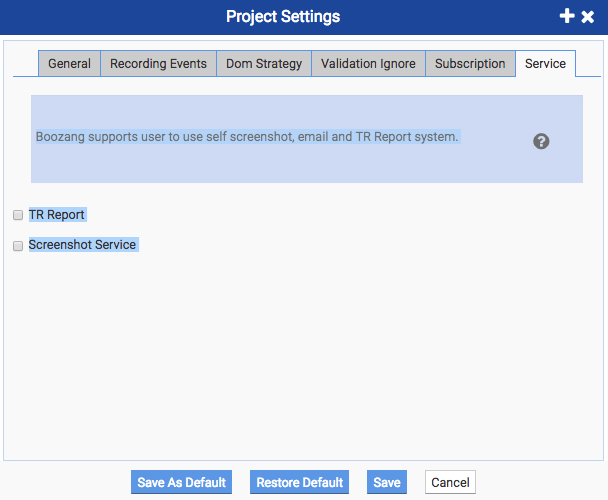

Test View
------------

The main test view is shown as soon as a test is selected in the left-hand tree navigation.

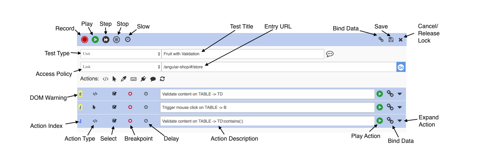

Here is an explanation of the different functions

Record
 : Starts a recording. This is the same as the Record function on the Functional panel.

Play
 : Plays the test case. This is the same as the Play function on the Functional panel.

Step
 : Runs the test action by action. This is the same as the Step function on the Functional panel.

Stop
 : Stops the execution of a test.

Slow
 : Toggles slow mode off/on. Slow modes inserts the delay specified under Settings->General.

Test Title  
 : The Test title 

Entry URL
 : The starting point the test will execute from

Bind data
 : Add a data binding to the test case.

Save
 : The test case is saved to the Boozang Cloud. lock is not released. In order to release lock click Save followed by Cancel. 

Cancel
 : Reloads test from server and releases lock.

Test Type
 : Cell, Unit, integration of Bug.

Access Policy
 : Link or Follow. A link test cases starts on Entry URL. A follow test case starts where the last test case left off. Cell tests are always of the follow Access Policy.

DOM Warning
  : When highlighted yellow it means the DOM matching policy found several items matching the description. This does not mean it will fail, but that either the source code or the the DOM selection policy should be updated for optimum results. 

Action Index
 : The index number of the action

Action Type
 : The Action Type icon

Select
 : An Action selector. Un-check to skip action execution.

Breakpoint
 : A breakpoint. Test execution will stop at active breakpoint. Click to toggle breakpoint. 

Delay
 : Here a minimum or maximum wait threshold can be set. The maximum threshold overrides the values under Settings -> General and is the maximum wait that
 will be done for an action before failing. The minimum threshold is the wait that will be done before doing the action call.

Action Description
 : Description of action. Often auto-generated, but can be set explicitly if needed.

Play Action
 : Play Single Action.

Bind Data
 : Open up data binding view to bind project data to action.

Expand
 : Expand action for detailed view (described individually below).

Actions
------------

### Validate ###

The Validate action creates and asserts condition, and is used to make sure a certain element of the page is as expected. A typical asserts condition could be a simple asserts-equals condition, such as making sure that after adding an item to cart, the item is present in the cart. The validation is a very versatile function and can be divided into HTML, SCRIPT, or DATA.

Validate (HTML)

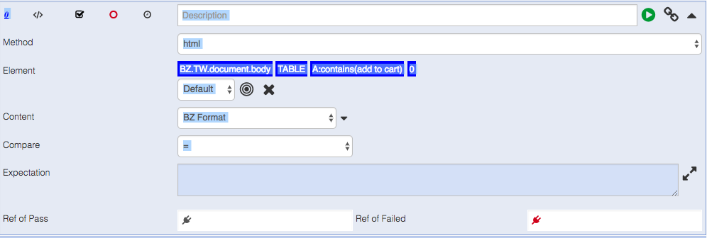

The asserts conditions can be done very flexible. The default asserts condition is an HTML asserts equal using BZ Format.
Below follows an explanation of the fields:

Method
 : The method could be either html, script or data. 

Element
 : This is the DOM tree element that the validation happens

Content
 : BZ Format, innerHTML, outerHTML, innerText, Attribute, Sub Dom Count, Parent Level. These are described in the Appendix section. 

Compare
  : A list of current compare operators. The default is equals (=).

Expectation
  : The value to compare with. This is automatically extracted from the document when creating the validation condition.

Ref of Pass
 : A goto condition for passed validation

Ref of Failed
 : A goto condition for failed validation   

Validate (SCRIPT)

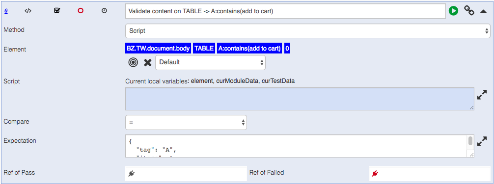

Method
 : The method could be either html, script or data. 

Element
 : This is the DOM tree element that the validation happens

Script
 : Create custom custom conditions in Java script for data values. 

Compare
  : A list of current compare operators. The default is equals (=).

Expectation
  : The value to compare with. This is automatically extracted from the document when creating the validation condition.

Ref of Pass
 : A goto condition for passed validation

Ref of Failed
 : A goto condition for failed validation   

Validate (DATA)

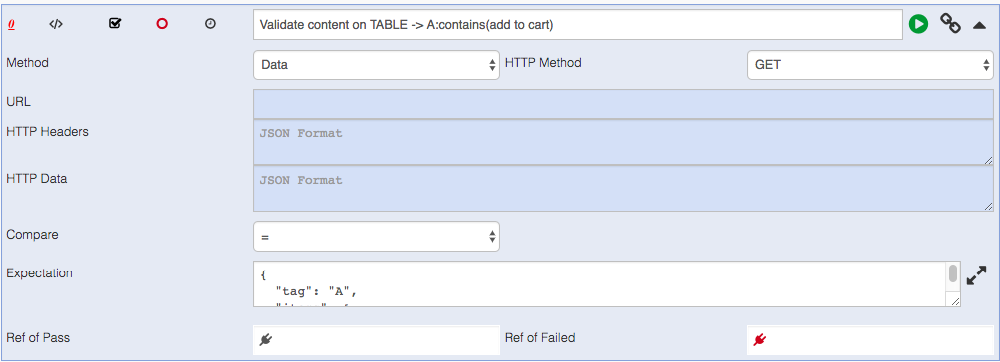

Method
 : For the DATA method, this could be further specified to be GET, POST, PUT, DELETE

URL
 : Thi is the API end-point URL

HTTP Headers
 : These are the request headers in JSON data

HTTP Data
 : This is the request body in JSON

Compare
  : A list of current compare operators. The default is equals (=).

Expectation
  : The value to compare with. This is automatically extracted from the document when creating the validation condition.

Ref of Pass
 : A goto condition for passed validation

Ref of Failed
 : A goto condition for failed validation   

### Trigger Event ###

The trigger event functionality is used to emulate an event in the browser. This is also what is generated automatically by the record function.

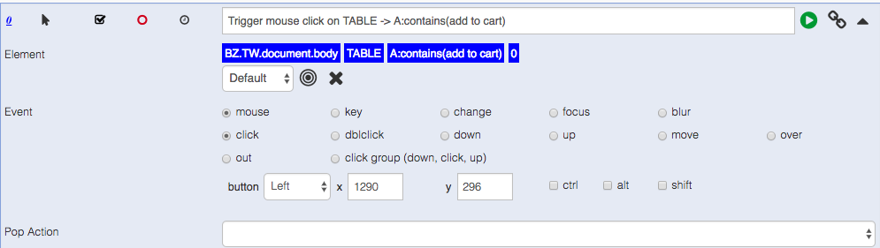

Element
 : This is the DOM tree element that the trigger event is acting on

Event
 : This is the actual event registered

 Pop Action
  : This allows the user to handle alert, confirm or prompt popups.

### Extract Data ###

The extract data is used to extract data from the page or from API calls. Just like validate, it's easier to handle these cases separately

Extract Data (HTML)

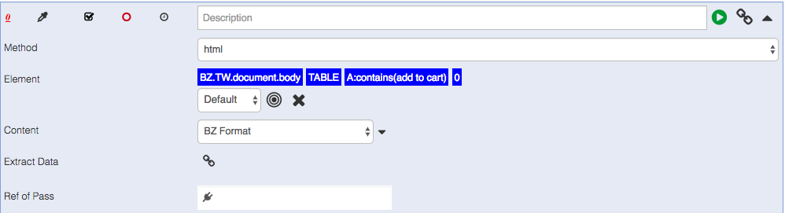

Method
 : For the HTML method, it extracts data from the page. 

Element
 : This is the DOM tree element that we are copying the data from

Content
 : BZ Format, innerHTML, outerHTML, innerText, Attribute, Sub Dom Count, Parent Level. These are described in the Appendix section. 

Extract Data
  : This is the data variable to copy the data to. See data section for setting up data structures.

Ref of Pass
 : A goto condition for passed validation

Ref of Failed
 : A goto condition for failed validation   

Extract Data (SCRIPT)

Method
 : Script let you set variables based on Java script.

Script
 : Java script to set local variables.

Content
 : BZ Format, innerHTML, outerHTML, innerText, Attribute, Sub Dom Count, Parent Level. These are described in the Appendix section. 

Extract Data
  : This is the data variable to copy the data to. See data section for setting up data structures.

Ref of Pass
 : A goto condition for passed validation

Ref of Failed
 : A goto condition for failed validation   

Extract Data (DATA)

Method
 : For the DATA method, it extracts data from an API call.

Element
 : This is the DOM tree element that we are copying the data from

Content
 : BZ Format, innerHTML, outerHTML, innerText, Attribute, Sub Dom Count, Parent Level. These are described in the Appendix section. 

Extract Data
  : This is the data variable to copy the data to. See data section for setting up data structures.

Ref of Pass
 : A goto condition for passed validation

Ref of Failed
 : A goto condition for failed validation   

### JS Code ###

The JS Code action is straightforward and allows for executing Java script directly in the browser. 

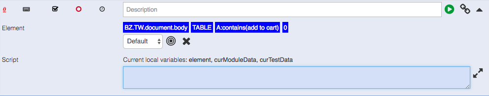

Element
 : This is the DOM tree element that we are executing the script on.

Script
: This is the java script being executed

### Plug test-case ###

This is the Goto functionality of the Boozang tool. This is often done to link together more basic test cases to larger, more complicated 
chains of tests. 

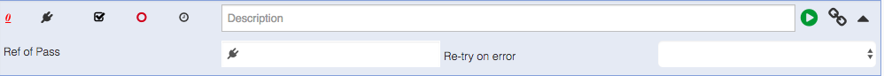

Ref of Pass
 : This is the Goto condition. A plug-tests case always executes successfully. 

Ref of Failed
 : This is the number of re-tries done in case of execution failure.   

### Comment ###

The comment allows you to create annotations directly in the page. This is really useful to highlight bugs and do point out look&feel discrepancies.

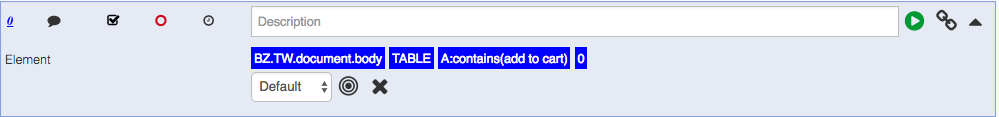

Element
 : This is the DOM tree element that we are annotating. 

### Refresh ###

This refreshes the whole page.

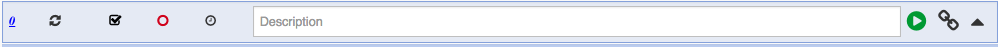
